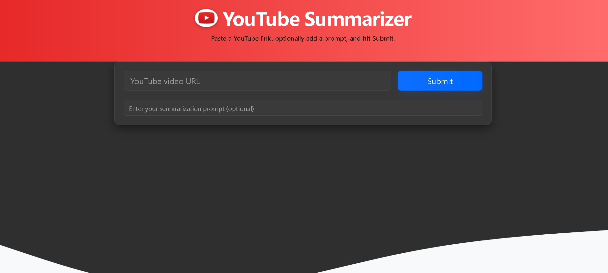

# 🎥 YouTube Video Summarizer

A Flask web application that downloads audio from a YouTube video, transcribes it using **Whisper**, and summarizes it using the **Groq API**.

## 🖼 Interface Preview


---

## ✨ Features
- 📥 YouTube audio download
- 🗣 Whisper transcription
- 🧠 Groq-powered summarization
- 🎨 Modern Bootstrap-based UI
- 🌙 Dark mode & copy-to-clipboard

---

## 📌 Requirements
- Python **3.10+**
- Groq API Key (stored in `.env`, never commit to GitHub)

---

## ⚡ Installation (Windows PowerShell)
```powershell
# 1️⃣ Clone the repository
git clone https://github.com/your-username/Youtube-video-Summarizer.git
cd Youtube-video-Summarizer

# 2️⃣ Create virtual environment
python -m venv venv

# 3️⃣ Activate virtual environment
.\venv\Scripts\Activate.ps1

# 4️⃣ Install dependencies
pip install -r requirements.txt
🔑 Setup
Create a .env file in the project root:

env
Copy
Edit
GROQ_API_KEY=your_groq_api_key_here
🚀 Run the App
powershell
Copy
Edit
python app.py
Now open your browser and go to:

cpp
Copy
Edit
http://127.0.0.1:5000


